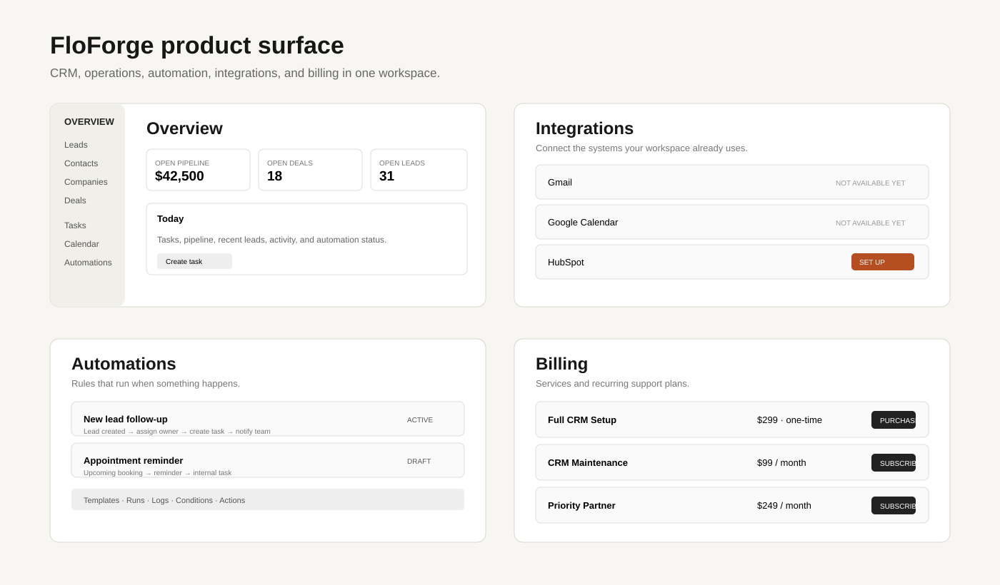
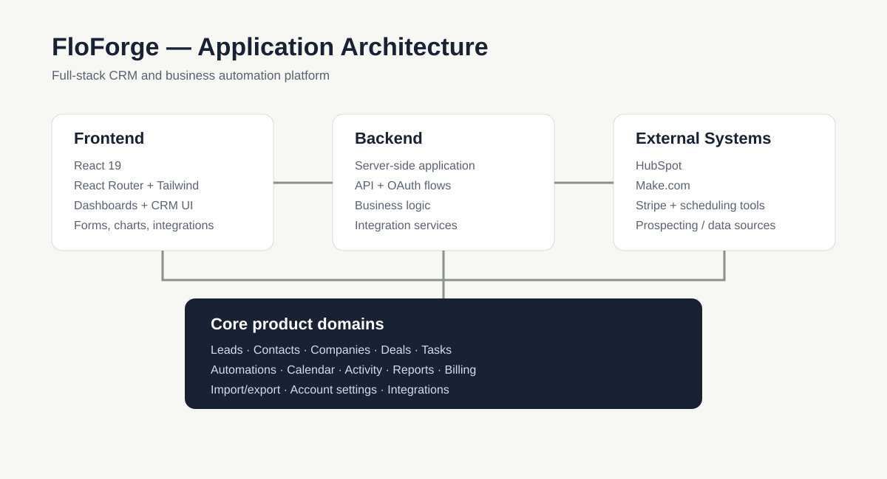

# FloForge

> A full-stack CRM and business automation platform built to help small businesses organize customer data and automate repetitive workflows.

[](https://github.com/Json-error/FloForge-Automations-website-v3.0-launch)

**Live demo:** https://floforge.org/

## Overview

FloForge is a full-stack SaaS project focused on practical business automation. The goal is simple: reduce repetitive administrative work by connecting customer information, workflows, scheduling, communication, and business systems in one place.

This repository contains the current FloForge website/application codebase, including the frontend, backend, automated tests, scripts, and supporting project documentation.

## Product Surface

The application currently includes a broad operations workspace with:

- **CRM** — leads, contacts, companies, and deals.
- **Work management** — tasks, calendar, and activity tracking.
- **Automation** — automation center, templates, runs, and workflow configuration.
- **Prospecting** — lead discovery and data-source workflows.
- **Analytics** — reports and operational overview dashboards.
- **Integrations** — connection management for CRM, scheduling, payments, prospecting, and automation tools.
- **Data** — CSV import/export workflows.
- **Billing** — service and recurring-plan management with Stripe.
- **Account controls** — settings, integrations, billing, and administrative areas.

> Integration availability varies by connector. The UI intentionally distinguishes available, connected, not-connected, and planned integrations rather than presenting every connector as production-ready.

## Product Tour



The product tour summarizes the main application surfaces visible in the current build: the operations overview, integration management, automation center, and billing area.

For the live interface, visit **https://floforge.org/**.

## Screenshots

Clean product screenshots should focus on the interface itself rather than browser chrome, phone status bars, or private data. Recommended showcase views:

1. **Overview dashboard** — CRM records, pipeline, tasks, activity, automation, and integration status.
2. **Integrations** — CRM, calendar, scheduling, payments, prospecting, and automation connectors.
3. **Automation Center** — preferably with a fictional/demo automation and run history populated.
4. **Billing** — service packages and recurring support plans.
5. **Landing page** — product positioning and primary call to action.

## Architecture



The project separates the React frontend from server-side functionality and external service integrations.

## Tech Stack

### Frontend

- React 19
- React Router
- Tailwind CSS
- Framer Motion
- Recharts
- Axios
- Radix UI
- React Hook Form
- Zod

### Backend

The repository includes a dedicated `backend/` application alongside the React frontend, including server-side functionality and integration/OAuth flows.

### Project Tooling

- Create React App / CRACO
- ESLint
- PostCSS
- GitHub
- Vercel configuration

## Repository Structure

```text
.
├── backend/          # Backend application and server-side functionality
├── frontend/         # React application
├── memory/           # Project-related memory/context files
├── scripts/          # Development and utility scripts
├── tests/            # Automated tests
├── test_reports/     # Test/report artifacts
├── docs/             # Developer-facing documentation and diagrams
├── design_guidelines.json
├── test_result.md
└── vercel.json
```

## Getting Started

### Prerequisites

- Node.js
- Yarn
- Access to any required backend services and environment variables

### Install dependencies

From the frontend directory:

```bash
cd frontend
yarn install
```

### Start the frontend

```bash
yarn start
```

### Create a production build

```bash
yarn build
```

### Run tests

```bash
yarn test
```

> Environment variables and backend configuration may be required for parts of the application that depend on external services. Do not commit secrets, API keys, or private credentials to the repository.

## Development Status

FloForge is an actively developed project. APIs, integrations, authentication, automation workflows, and product features may change as development continues.

The repository should therefore be treated as a development project rather than a promise that every feature visible in the product is production-ready.

## Why This Project Exists

Small businesses often have customer information scattered across spreadsheets, inboxes, calendars, forms, CRMs, and other tools. FloForge explores how those disconnected processes can be turned into repeatable workflows.

The larger objective is not simply to build another dashboard. It is to make business operations more programmable: capture information once, trigger the right workflow, keep systems synchronized, and reduce unnecessary manual work.

## Roadmap

- [ ] Expand CRM functionality
- [ ] Build additional workflow automation capabilities
- [ ] Improve scheduling and booking workflows
- [ ] Expand third-party integrations
- [ ] Improve authentication and account security
- [ ] Improve testing and reliability
- [ ] Improve developer documentation
- [ ] Continue refining the user experience

## Contributing

Issues, feature ideas, bug reports, and technical feedback are welcome.

For larger changes, open an issue first to discuss the proposed approach before submitting a pull request.

## Security

Never commit secrets or credentials. Use environment variables for API keys, authentication secrets, database credentials, and other sensitive configuration.

If you discover a security issue, do not publish sensitive details in a public issue. Contact the project owner privately instead.

## Links

- **Repository:** https://github.com/Json-error/FloForge-Automations-website-v3.0-launch
- **Live demo:** https://floforge.org/

---

Built as an independent SaaS project exploring CRM, integrations, and business automation.
